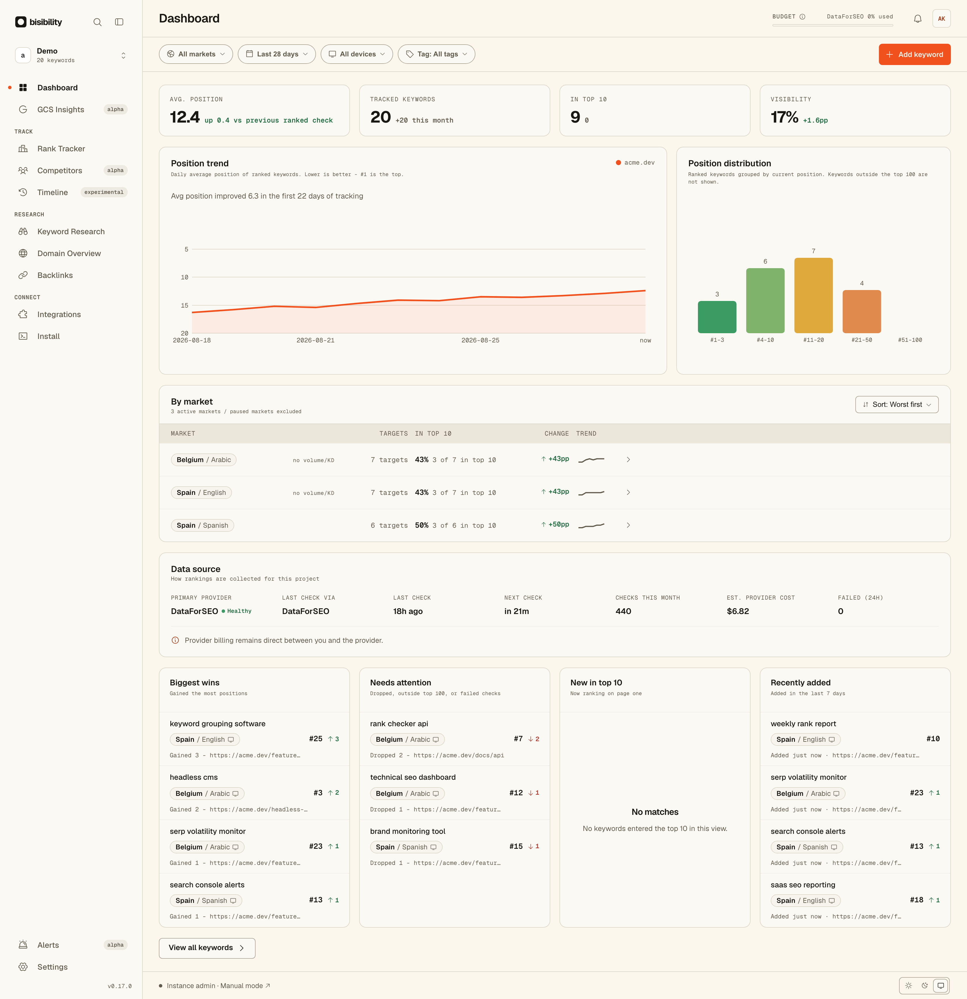

# bisibility

> Own your search visibility data.

bisibility is an open-source SEO platform for researching keywords, inspecting
backlinks, and tracking Google rankings.

Start with the Cloud beta or self-host it. Use your data in the dashboard, through
the API or MCP, or directly from PostgreSQL.

For rank checks, connect your own DataForSEO or SerpAPI account. Self-hosted
deployments keep provider credentials in your instance; Cloud beta stores them
encrypted in the managed service. Billing remains directly between you and the provider.

bisibility stays focused on search visibility workflows. It is not a general-purpose
technical site-audit, content-writing, or on-page optimization suite.

[](https://github.com/CorgiCorner/bisibility/actions/workflows/ci.yml)
[](LICENSE)

[Self-hosting guide](https://bisibility.com/docs/self-hosting) ·
[Documentation](https://bisibility.com/docs) ·
[API reference](https://bisibility.com/docs/api/overview) ·
[FAQ](https://bisibility.com/faq) ·
[Roadmap](https://bisibility.com/roadmap)

## Early release

bisibility is an early release. Everything listed as Available can be tested today, but
you may encounter rough edges and breaking changes before 1.0.

Please report installation problems, bugs, and workflow feedback through
[GitHub Issues](https://github.com/CorgiCorner/bisibility/issues).



*Dashboard running with demo data.*

## Try the local demo

```bash
git clone https://github.com/CorgiCorner/bisibility.git bisibility
cd bisibility
./scripts/dev/bootstrap-local.sh
docker compose up -d
```

Open [http://localhost:3000](http://localhost:3000) and sign in with email
`demo@acme.dev` and OTP `000000`.

Compose pulls the version-pinned web image from Docker Hub by default. To build
the checked-out source instead, run `docker compose up --build`.

> [!WARNING]
> Demo authentication is intentionally insecure and is meant for a throwaway local
> installation only. Remove both `DEMO_*` variables and configure an email provider
> (`EMAIL_PROVIDER` with [Resend or Amazon SES](https://bisibility.com/docs/guides/email))
> before exposing an instance to other users or real data.

### Enable scheduled checks

The default Compose stack runs manual rank checks only. To run recurring schedules,
start the Temporal worker profile:

```bash
docker compose --profile scheduled up -d
```

The scheduled profile also serves the Temporal Web UI at
[http://localhost:8233](http://localhost:8233).
It pulls the version-pinned worker image by default; add `--build` to build both
first-party images from the checkout.

## Why bisibility?

- **Research before you track.** Explore keyword opportunities and backlink data, then
  use the findings to decide what belongs in a tracked project.
- **Own the history.** Positions, ranking URLs, timestamps, and per-check provider
  cost data live in a PostgreSQL database you operate, with direct SQL access and
  full-history export.
- **Inspect the system.** The dashboard, scheduler, provider adapters, and delivery
  pipeline are open source under AGPL-3.0.

## Why use bisibility instead of raw provider APIs?

Provider APIs return individual datasets and result snapshots. bisibility turns them
into persistent research, monitoring, alerting, and automation workflows:

- normalizes rank results from DataForSEO and SerpAPI behind one application model,
  with access to stored normalized SERP snapshots when you self-host;
- stores position history in PostgreSQL and runs per-keyword schedules with
  project-level defaults and per-keyword overrides;
- records provider-reported rank-check costs when available and stores estimates
  separately otherwise;
- evaluates alert rules after new results arrive and notifies in-app and by email;
- exposes history through the dashboard, REST API v1, CSV export, and MCP, and
  delivers events through signed outbound webhooks.

## Product status

Available means the capability can be tested in this early release; it does not imply
a stable 1.0 contract.

| Capability | Status |
| --- | --- |
| Google rank tracking | Available |
| Keyword research | Available |
| Backlink research | Available |
| REST API and OpenAPI | Available |
| MCP endpoint | Available |
| TypeScript, Python, and Go SDKs | Available |
| CLI | Developer preview |
| Self-hosting with Docker | Available |
| Managed Cloud | Open beta |
| Domain overview | Planned |

### Included workflows

- Keyword research with related queries, suggestions, ideas, search volume, 12-month
  trends, CPC, competition, difficulty, and intent data
- Backlink research with referring domains and pages, 12-month new and lost link
  history, authority and spam metrics, and link attributes
- Rank tracking with position history, trend charts, and intended URL monitoring
- Competitor benchmarking with Share of Voice
- Manual, daily, weekly, monthly, and custom cron schedules
- Rank alerts in-app and by email, plus weekly email digests for projects with
  recent rank-check activity
- Keyword tags and saved views
- Opt-in Search Console connections, with queries, clicks, and impressions per keyword
- Opt-in GA4 connections with landing-page sessions, engagement, and key events
- Google index status on keyword details
- REST API v1 with OpenAPI, an MCP endpoint, signed outbound webhooks, and CSV export
- Owner, Admin, Editor, and Viewer team roles, with an audit log

## Not yet

Tracked on the [roadmap](https://bisibility.com/roadmap): Slack alert delivery,
AI Overview and LLM visibility tracking, domain overview, Cloud general availability,
Cloud usage limits and billing controls, and Cloud uptime SLA and backup restore targets.

## AI agents and MCP

bisibility is API-first. Agents work with the same projects, keywords, checks, alerts,
and history that power the dashboard: the REST API, the OpenAPI schema, and the MCP
endpoint converge on the same application model, so agent behavior does not rely on
dashboard scraping.

For example, connect Codex to a self-hosted instance with a personal access token:

```bash
export BISIBILITY_TOKEN="bsb_pat_live_..."
codex mcp add bisibility \
  --url "https://your-host.example/api/mcp" \
  --bearer-token-env-var BISIBILITY_TOKEN
```

Project API keys work too. Other clients use different configuration fields, but the
HTTP connection uses the `/api/mcp` Streamable HTTP endpoint and an
`Authorization: Bearer <token>` header. The MCP endpoint is available in the current
early release, but tool names and schemas may change before 1.0. The endpoint
advertises its tool inventory through the
[MCP server card](https://bisibility.com/.well-known/mcp/server-card.json).

### Example agent workflow

> Find the tracked keywords whose latest completed check is at least three positions
> worse than their previous completed check, and return their current ranking URLs.

The built-in endpoint and the separately installed `@bisibility/mcp` package expose the
same unprefixed `snake_case` tools. For this workflow, an agent can:

1. select the project with `list_projects`;
2. paginate through `list_keywords`;
3. request the two latest completed checks with `get_rank_history`;
4. compare numeric positions and return the latest ranking URL when available.

When fewer than two completed checks exist, the agent should report
`schedule.next_check_at`. It can offer `run_rank_check` instead, but only with write
access and the user's explicit approval of the provider cost. This workflow makes one
history call per keyword, so it is best suited to small projects.

The CLI and typed TypeScript, Python, and Go SDKs are available to test. CLI commands,
flags, and output formats may change before 1.0.

[Agent documentation](https://bisibility.com/docs/agents)

## Provider support

| Capability | DataForSEO | SerpAPI |
| --- | ---: | ---: |
| Google rank checks | Available | Available |
| Keyword research | Available | Not supported |
| Backlink research | Available | Not supported |
| Stored normalized SERP snapshot (self-hosted) | Available | Available |
| Rank-check cost record | Provider reported | Configured or estimated |

## Self-hosting in production

Production deployments need PostgreSQL, Valkey or another Redis-compatible endpoint, and a supported SERP provider
account. Scheduled checks additionally require the Temporal worker. Read the
[self-hosting guide](https://bisibility.com/docs/self-hosting) before serving real
traffic.

## Cost model

Self-hosted bisibility has no application subscription and no per-keyword license fee.
You pay separately for:

1. the infrastructure you run;
2. SERP requests made through your own DataForSEO or SerpAPI account;
3. optional third-party services such as email delivery.

bisibility does not resell SERP data: provider credentials and billing remain between
you and the provider. Completed checks store provider-reported cost when available.
When a provider does not return a per-response dollar amount, bisibility keeps the
configured or model-based estimate separately. Use the
[rank-tracking cost calculator](https://bisibility.com/rank-tracking-cost-calculator)
before enabling a large schedule.

## Architecture

- Next.js serves the dashboard and the REST API.
- PostgreSQL is the durable source of truth.
- Valkey ships by default; any Redis-compatible endpoint can hold shared runtime state.
- Temporal runs recurring rank checks; manual and scheduled checks share the same
  runner and persistence model.
- SERP and analytics providers are pluggable adapters.

## Managed Cloud

bisibility Cloud is available in open beta and is not generally available yet. It runs
the same core application without requiring you to operate PostgreSQL, Valkey,
or the Temporal worker.

bisibility Cloud itself is free during the open beta and does not require a payment
method. Provider usage is not included: DataForSEO or SerpAPI requests are billed
directly to your connected provider account. Cloud pricing will be announced before
the beta ends, and nothing will be charged without explicit confirmation. Self-hosting
remains available without an application subscription.
[Start the Cloud beta](https://bisibility.com/).

## Documentation

- [Self-hosting guide](https://bisibility.com/docs/self-hosting)
- [API quickstart](https://bisibility.com/docs/quickstart)
- [API reference](https://bisibility.com/docs/api/overview)
- [Agent documentation](https://bisibility.com/docs/agents)
- [FAQ](https://bisibility.com/faq)

## Contributing

Public issues and feature specifications are welcome. This repository does not
accept pull requests. See [CONTRIBUTING.md](CONTRIBUTING.md) and
[CODE_OF_CONDUCT.md](CODE_OF_CONDUCT.md).

## Security

Do not report vulnerabilities through public issues. See [SECURITY.md](SECURITY.md)
for responsible disclosure.

## License

`AGPL-3.0-only`. See [LICENSE](LICENSE).

You may use, modify, and self-host bisibility. If you modify it and let users interact
with that version over a network, the license requires you to offer those users the
corresponding source code.

The license text governs. This summary is not legal advice.
