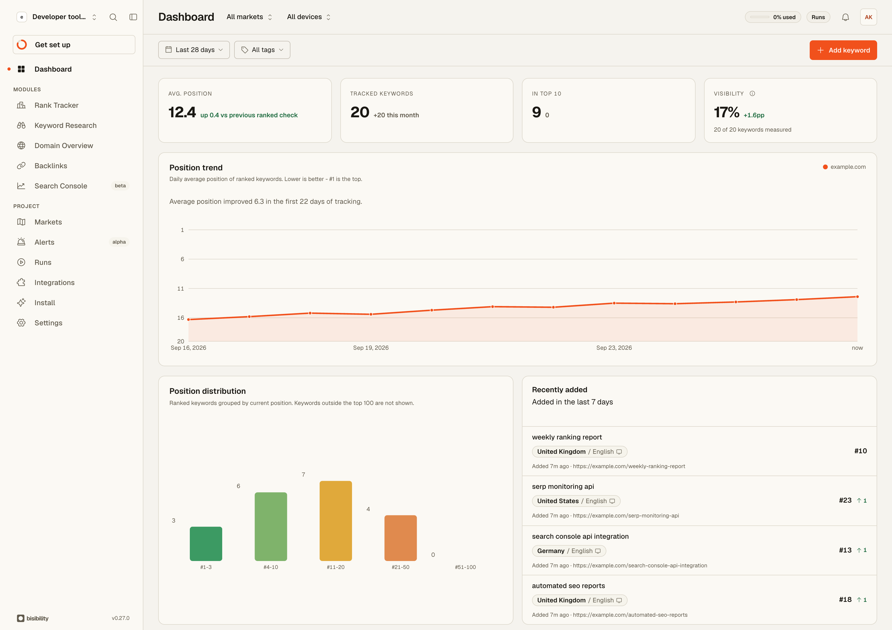

# bisibility

> Open-source SEO platform for developers and AI agents.

Research keywords, inspect backlinks, and track Google rankings through a dashboard,
REST API, or MCP. Build SEO into your own tools and agent workflows, with a
PostgreSQL history you can query and export. Self-host it or use the hosted beta.

[](https://github.com/CorgiCorner/bisibility/actions/workflows/ci.yml?query=event%3Apush)
[](LICENSE)

[Try the demo](https://demo.bisibility.com) ·
[Documentation](https://bisibility.com/docs) ·
[Self-host](https://bisibility.com/docs/self-hosting) ·
[Discord](https://discord.gg/HcYpvfn79w) ·
[X](https://x.com/bisibility_com)



*Real application UI with synthetic demo data, not customer results.*

## Built for code and agents

- **API-first, not dashboard scraping.** REST API v1, OpenAPI, and MCP expose
  authenticated operations for projects, keywords, checks, alerts, and history.
- **Use your stack.** TypeScript, Python, and Go SDKs, a CLI, and signed outbound
  webhooks connect SEO data to scripts, CI pipelines, and internal tools.
- **Give agents a bounded workflow.** Discover tools, inspect stored data, estimate
  costs, and approve paid checks explicitly. Use a personal access token or
  project-scoped API key; hosted MCP also supports OAuth.
- **Keep your data.** Self-hosted history lives in your PostgreSQL database.
  Connect your own providers instead of depending on a bundled data subscription.

| Interface | Start here |
| --- | --- |
| REST + OpenAPI | [API reference][api-ref] |
| MCP + agent workflows | [Agent guide](https://bisibility.com/docs/agents) |
| TypeScript / Python / Go | [SDKs](https://bisibility.com/docs/sdks/overview) |
| Terminal + automation | [CLI](https://bisibility.com/docs/cli) |
| Events | [Webhooks](https://bisibility.com/docs/api/webhooks) |

Start with a read-only API call using your [API credential](https://bisibility.com/docs/authentication):

```bash
curl --fail-with-body "https://your-host.example/api/v1/projects" \
  -H "Authorization: Bearer $BISIBILITY_API_KEY"
```

Connect an MCP client to `https://your-host.example/api/mcp`, or
`https://bisibility.com/api/mcp` for the hosted service. Start with a read-only
task: “Summarize ranking gains and losses from stored history; do not run paid checks.”
See the [agent guide](https://bisibility.com/docs/agents) for authentication and
cost-approval examples, and [client compatibility](https://bisibility.com/docs/compatibility)
for released client coverage.

## SEO workflows

- Keyword research: suggestions, search volume, trends, CPC, difficulty, and intent.
- Backlink research: referring domains, new and lost links, and link attributes.
- Rank tracking: ranking URLs, history, schedules, alerts, and competitor Share of Voice.
- Domain overview: organic visibility, ranked keywords, and top pages; requires a
  bring-your-own DataForSEO connection; metered. The app and REST API are available.
  See [released client support](https://bisibility.com/docs/compatibility).
- Context: opt-in Search Console and GA4 connections, plus deploy and CMS signals.

Rank checks support DataForSEO and SerpAPI; keyword, backlink, and domain research
use DataForSEO. Provider usage is billed by your connected provider. In self-hosted
deployments credentials stay in your instance; the hosted service stores them encrypted.

This is an early release, not a stable 1.0 contract. AI Overview and LLM visibility
tracking are [roadmap items](https://bisibility.com/roadmap), not shipped features.
Slack tenant delivery is available as an API-only preview. Workspace installation
and channel management are not yet exposed in the dashboard.

## Run it your way

- **Explore locally:** the [demo quickstart](https://bisibility.com/docs/quickstart)
  provides synthetic data and intentionally insecure demo authentication. Not for production.
- **Self-host:** follow the [production guide](https://bisibility.com/docs/self-hosting).
  Run Next.js, PostgreSQL, and Valkey or another Redis-compatible service.
  Recurring checks also need Temporal and the worker.
- **Hosted:** [start without operating the stack](https://bisibility.com/).
  See [deployment options](https://bisibility.com/docs/deployment-options).

Self-hosting has no application subscription or per-keyword license fee.
Infrastructure and provider usage are separate costs.
[Estimate rank-check costs](https://bisibility.com/rank-tracking-cost-calculator)
before enabling a large schedule.

## Community and license

Ask questions on [Discord](https://discord.gg/HcYpvfn79w), follow updates on
[X](https://x.com/bisibility_com), or [report an issue](https://github.com/CorgiCorner/bisibility/issues).
Public pull requests are not accepted; see the [contribution guide](.github/CONTRIBUTING.md)
and [code of conduct](.github/CODE_OF_CONDUCT.md).
Report vulnerabilities privately through the [security policy](.github/SECURITY.md).

The application is [AGPL-3.0-only](LICENSE). The
[Claude Code plugin](plugins/bisibility/) is separately [MIT licensed](plugins/bisibility/LICENSE).

[api-ref]: https://bisibility.com/docs/api-reference/discovery/get-api-capabilities
