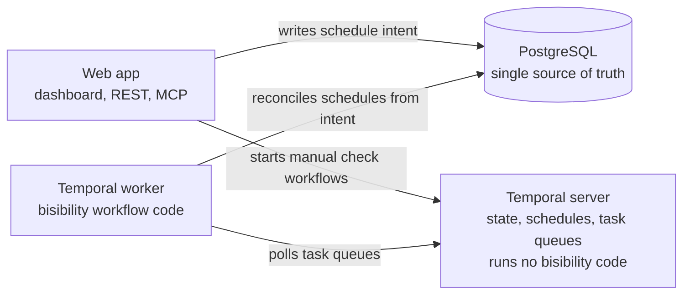

bisibility has two main processes:

- The web app serves the dashboard, REST API, Model Context Protocol (MCP), and
  live notifications.
- The Temporal worker runs scheduled rank checks and maintenance jobs.

Both processes use PostgreSQL. Valkey ships by default, while any Redis-compatible
endpoint can handle rate limits, idempotency,
and notifications. Rank data comes from a SERP provider that you connect
yourself.

## Runtime components

| Component | Lives in | Responsibility |
| - | - | - |
| Web app | `app/`, `components/` | Authenticated dashboard, onboarding, settings, keyword and alert views. |
| REST API v1 | `app/api/v1/`, `lib/api/` | API-key auth, rate limits, idempotency, and all `/api/v1` endpoints. |
| MCP endpoint | `lib/mcp/` | Streamable HTTP transport whose tools call the same REST router. |
| Notification stream | `app/api/notifications/` | Server-sent events for the in-app bell, fanned out through Redis pub/sub. |
| Temporal worker | `lib/temporal/` | Runs scheduled rank checks, schedule reconciliation, and maintenance jobs. |
| PostgreSQL | `prisma/schema.prisma` | All durable state: projects, keywords, checks, providers, alerts, audit log. |
| Valkey or another Redis-compatible endpoint | `lib/redis/` | API and provider rate limiting, idempotency replay, notification pub/sub. |
| Providers | `lib/providers/` | Pluggable SERP and analytics adapters. See [Integrations](/integrations). |

The MCP endpoint uses the same router as REST. Manual and scheduled checks also
use the same rank-check runner. These shared paths keep behavior consistent.

## The worker is not the Temporal server

Temporal is split into two independent pieces, and only one of them ships in the
bisibility images.

The **Temporal server** stores workflow state, history, schedules, and task
queues. It runs no bisibility code and knows nothing about rank checks. It is
infrastructure that the stack connects to.

The **Temporal worker** is a bisibility process. It hosts the workflow and
activity code, polls the server for due work, and executes it. This is the
`bisibility-worker` image.



Two consequences follow.

Starting the worker on its own does nothing. It needs a reachable Temporal
server, which is why the Temporal topology needs `TEMPORAL_ADDRESS`, a dedicated
`TEMPORAL_NAMESPACE`, and both task queues. The web app needs the same values,
not to manage schedules, but to start workflows. `SCHEDULER_DRIVER=none` keeps
manual checks inline and disables scheduled execution in the core topology.

The Temporal server is replaceable. Docker can add the bundled Temporal overlay,
but the same worker image runs unchanged against a self-managed cluster or
Temporal Cloud. See
[Temporal Server or Temporal Cloud](/self-hosting/temporal#temporal-server-or-temporal-cloud).

## Data model

A `Project` owns its keywords, provider connections, alert rules,
notifications, and audit entries. Each keyword is unique by text, location, and
device.

Scheduling is stored as *intent*, not as jobs: `ProjectDefaults` holds the
project-wide schedule and market, and an optional per-keyword `KeywordSchedule`
overrides it. Each executed check is a `RankCheck` row recording status,
position, ranking URL, provider, and cost. Alerts connect `AlertRule` to
`TriggeredAlert` and `DeliveryAttempt` rows.

## Rank data retention by deployment

Each completed check can store a normalized SERP snapshot in `rank_checks.raw`.
The adapters reduce provider responses to normalized organic results and SERP
feature labels before storage. That snapshot is separate from the rank-history
fields that remain on the row.

| Data | Self-hosted | Hosted |
| - | - | - |
| Rank-check row, `position`, and `organicRanks` | Kept for the lifetime of the project. | Kept for the lifetime of the project, with no plan-based retention tier. |
| Normalized SERP snapshot (`rank_checks.raw`) | Kept indefinitely by default. The operator can set `RANK_CHECK_RAW_RETENTION_DAYS` to 1-3650 days or `unlimited`. | Kept for 90 days. |

Snapshot access is a self-hosted feature through direct PostgreSQL access to
`rank_checks.raw`; the REST API rank-check resource does not expose this field.
Once a configured window expires, an older check can therefore have a null
`raw` value while its row, `position`, and `organicRanks` remain available. See
[Database growth](/self-hosting/operations#database-growth) for worker configuration and
purge behavior.

## Rank-check lifecycle

```text
schedule intent (Postgres)
  -> worker reconciler converges Temporal Schedules to match intent
  -> a due schedule starts a rank-check workflow
  -> runner tries the provider chain (priority order, fallback on failure)
  -> result persists as a RankCheck row
  -> alert evaluation
  -> notifications and channel deliveries
```

The app never creates Temporal Schedules directly. It only writes schedule
intent to Postgres; a singleton reconciler in the worker periodically converges
per-keyword Temporal Schedules to match that intent, creating, updating, and
pruning them as keywords change. Postgres stays the single source of truth, and
the worker is safe to restart or temporarily disable.

Manual checks go through the same runner and persistence (`lib/rank-check/`)
as scheduled checks. When Temporal is unreachable, interactive manual checks
fall back to inline execution in the app process; the REST API can also start
a check asynchronously and return `202`.

## Extensibility: providers

Providers are the main extension point, under `lib/providers/`.

**Kinds.** Every provider has a kind. `serp` providers answer "where does this
keyword rank" and are tried in a user-configured fallback chain; `analytics`
providers add owned-data context such as traffic and clicks, and never set
positions. A new category of data source - social media, for example - would be
a new kind following the same pattern.

**Registry.** `PROVIDER_CATALOG` in `lib/providers/registry.ts` is the single
source of truth for which providers exist, their kind, and the credentials
they require. The user-facing roster and setup details live in
[Integrations](/integrations).

**Adapters.** Each provider is one adapter module implementing a small
interface: identify itself, test a connection, fetch a rank. Adding a search
engine such as Bing means writing one new `serp` adapter and registering it in
the catalog - the scheduling, fallback, cost, and alerting machinery is
provider-agnostic and does not change.

Connected credentials are stored encrypted per project. Optional environment
fallbacks for local development are documented in
[Integrations](/integrations).

## Alerts and notifications

After a successful check persists, the alert evaluator applies each enabled
rule's conditions to the new result. Matching rules create a triggered alert,
which is delivered to the configured channels - email and signed webhooks -
with every delivery attempt recorded. Slack delivery is planned. Successful
deliveries and completed checks also create in-app notifications, pushed live
to the browser over SSE.

## Operational notes

**Valkey** backs the cross-process concerns by default: API and outbound provider rate
limits, idempotency replay for non-GET API requests, and pub/sub fan-out for
realtime notifications. Local development degrades to in-memory fallbacks when
Redis is absent.

**Temporal workflow code stays deterministic.** Workflows contain no database,
network, or Node-specific calls; all side effects live in activities. This
standard Temporal boundary is what makes scheduled checks replayable and safe
across worker restarts.

**Code layering** - which modules may import which - is lint-enforced; see
[CONTRIBUTING.md](https://github.com/CorgiCorner/bisibility/blob/main/CONTRIBUTING.md#code-conventions)
in the repository.
